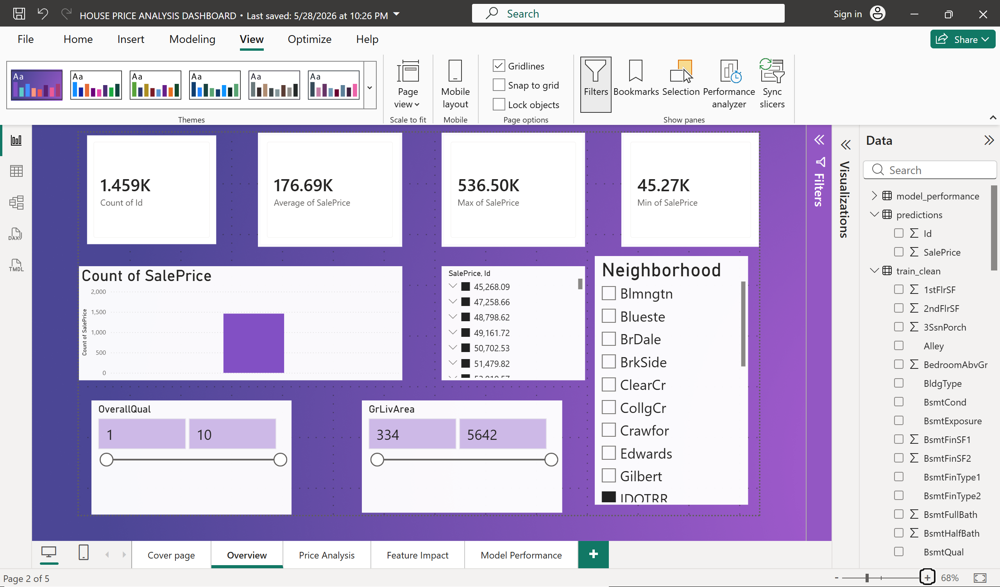
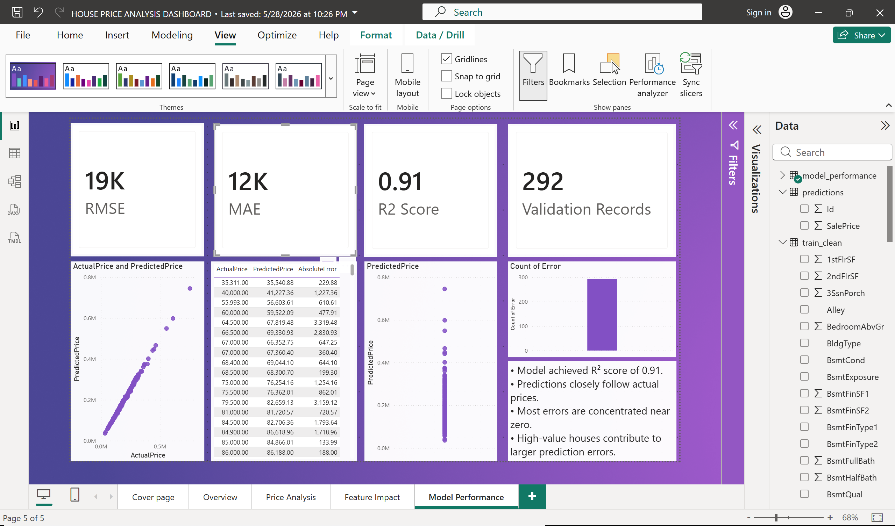

# House-Price-Prediction
# 🏠 House Price Prediction using Machine Learning & Power BI

## 📌 Project Overview

This project focuses on predicting residential house prices using Machine Learning techniques and visualizing key insights through an interactive Power BI dashboard.

Using the Kaggle House Prices dataset, I performed data preprocessing, exploratory data analysis (EDA), feature engineering, model development, and performance evaluation to build an accurate house price prediction system.

---

## 🎯 Objectives

* Predict house sale prices based on property features.
* Identify factors that influence house prices.
* Compare machine learning models for prediction accuracy.
* Visualize insights and model performance using Power BI.

---

## 📂 Dataset

**Dataset:** House Prices – Advanced Regression Techniques

The dataset contains residential property information such as:

* Overall Quality
* Living Area
* Garage Area
* Basement Area
* Number of Rooms
* Number of Bathrooms
* Sale Price

---

## 🛠️ Technologies Used

* Python
* Pandas
* NumPy
* Matplotlib
* Seaborn
* Scikit-Learn
* Power BI

---

## 🔍 Project Workflow

### 1. Data Preprocessing

* Missing value handling
* Feature selection
* Data cleaning

### 2. Exploratory Data Analysis (EDA)

* Correlation analysis
* Distribution analysis
* Feature relationship analysis

### 3. Feature Engineering

Created additional features such as:

* TotalBath
* TotalSF

### 4. Model Development

Implemented:

* Linear Regression
* Random Forest Regressor

### 5. Model Evaluation

Evaluation metrics:

* RMSE (Root Mean Squared Error)
* MAE (Mean Absolute Error)
* R² Score

---

## 📊 Power BI Dashboard

The dashboard includes:

### Dashboard Overview

* Total Houses
* Average Sale Price
* Maximum Sale Price
* Minimum Sale Price

## Dashboard Preview





### Feature Analysis

* Impact of key housing features
* Correlation insights

### Model Performance

* Actual vs Predicted Prices
* Error Analysis
* RMSE, MAE and R² Score

---

## 📈 Key Insights

* Overall Quality is one of the strongest predictors of house prices.
* Larger living areas generally lead to higher sale prices.
* Garage Area and Total Square Footage significantly influence house value.
* Machine Learning models can effectively estimate residential property prices.

---

## 📁 Repository Structure

```text
House-Price-Prediction/
│
├── notebooks/
│   └── House_Price_Prediction.ipynb
│
├── dashboard/
│   ├── HousePriceDashboard.pbix
│   ├── dashboard_overview.png
│   └── model_performance.png
│
├── outputs/
│   └── submission.csv
│
├── requirements.txt
├── README.md
└── .gitignore
```

---

## 🚀 Future Improvements

* Hyperparameter tuning
* Advanced feature engineering
* XGBoost implementation
* Deployment using Streamlit

---

## 👩‍💻 Author

**Bharghavi**

Aspiring Data Analyst | Machine Learning Enthusiast

Skills:
Python • SQL • Power BI • Machine Learning • Data Analytics

---

⭐ If you found this project interesting, consider giving the repository a star.
